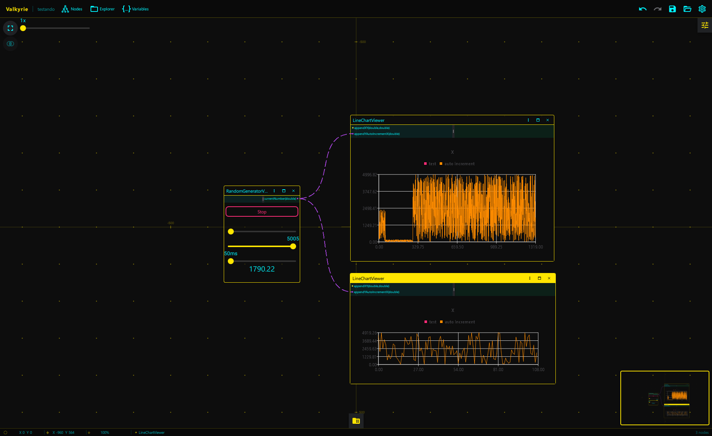

# Qt-NodesTool

Qt-NodesTool is a project designed to leverage the capabilities of Qt for advanced tool development. This project is built using **Qt 6.5.3 MSVC2019 - 64bits**, ensuring performance and compatibility with modern systems.


## Requirements

To build and run Qt-NodesTool, you need the following:

- **Qt 6.5.3** development kit (configured for MSVC2019 - 64bits).
- A C++ compiler compatible with MSVC2019.
- CMake

## Installation

1. Clone this repository:
   ```bash
   git clone https://github.com/your-repository/QtNode-tools.git

# Screenshots
